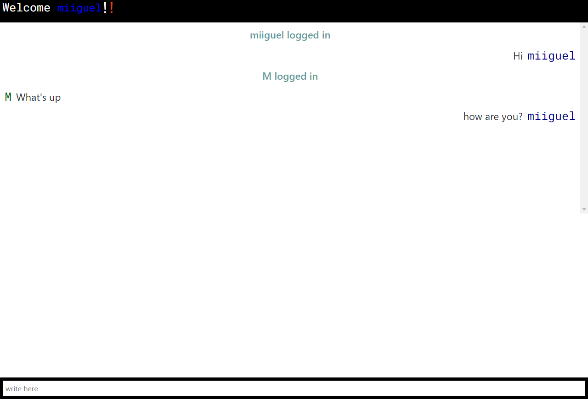

# Chat with Sockets


### Functions file chat.js

| Function | Description |
| --- | ---|
| sendMessage(from, message)| Receive _from_ parameter that is the user send the message and _message_ parameter that user sends. |
| readMessages(io) | Receive _io_ parameter that is the object io from socket.io library and return the messages array


This app needs to install the dependencies with next command:
```nodejs
npm install
```

To start chat's app
````nodejs
npm run
````


### Licence (c) Miguel Angel Martinez